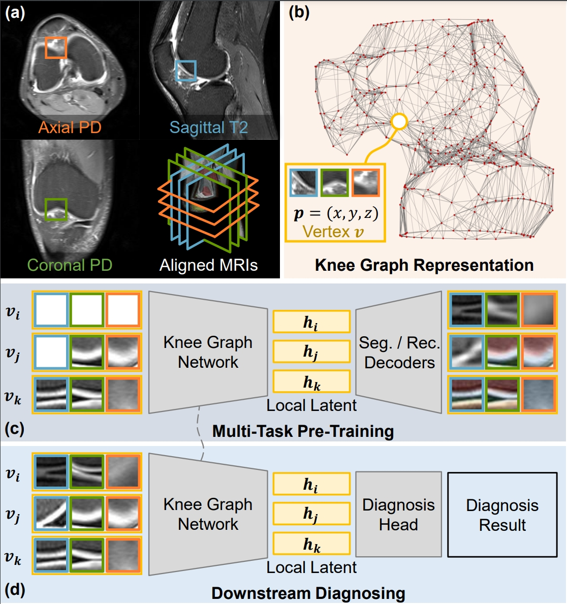
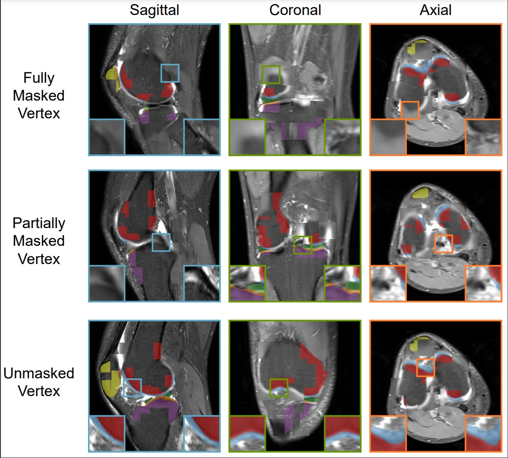

# Knee Graph Network (KGNet)
This is the official implementation of the paper **[Enhancing Knee Disease Diagnosis via Multi-view Graph Representation with Multi-Task Pre-Training](https://github.com/zixuzhuang/KGNet)** .

## Abstract
Magnetic resonance imaging~(MRI) is an indispensable tool for clinical knee examination, which often scans 2D stacked slices from multiple views.
Radiologists typically locate lesion regions in one view, and then refer to other views to formulate a comprehensive diagnosis.
However, existing computer-aided diagnosis methods fall short of identifying and fusing local regions in multi-view scans, leading to a decline in diagnostic performance and a heavy reliance on extensively annotated data.
This paper introduces a novel framework that represents multi-view MRI scans as a knee graph, and conducts diagnosis using the proposed Knee Graph Network (KGNet).
Moreover, KGNet is greatly enhanced by multi-task pre-training, which requires KGNet to reconstruct masked knee local patches and segment unmasked ones working alongside corresponding decoders.
Experimental evaluations on public and in-house clinical datasets confirm that our framework outperforms existing approaches in diagnosing cartilage defects, anterior cruciate ligament tears, and knee abnormalities.
In conclusion, our framework demonstrates the potential of enhancing knee disease diagnosis by representing multi-view MRI scans as a graph and employing multi-task pre-training in the graph network.

## Framework


## Visualized Multi-View and Multi-Task Results


## Installation and Usage 
To set up the environment for this project, we recommend using Conda for managing dependencies. 

The following steps will guide you through the installation process:

### 1. **Create a new Conda environment**
Make sure you have Conda installed on your system. Then, run the following command to create a new environment named `KGNet`:
```bash
conda create --name KGNet python=3.10
conda activate KGNet
# Install CUDA and other packages (adjust CUDA version as needed, e.g., 11.7)
conda install nvidia/label/cuda-11.7.1::cuda-toolkit
pip install -r requirements.txt
pip install dgl==1.0.2+cu117 -f https://data.dgl.ai/wheels/cu117/repo.html
```
**Note**: Make sure to adjust the CUDA version (cudatoolkit=11.7) to match your system's configuration.

### 2. **Building Knee Graph Representation**

**A. Data Preparation**
- **For MRNet Dataset:**
    To begin, download the preprocessed MRNet dataset from [here](https://stanfordmlgroup.github.io/competitions/mrnet/).

    The corresponding **segmentation masks** for the MRNet dataset can be downloaded from [here](https://drive.google.com/file/d/1f8f5XY9DNqopyk8yVgUwaCc81MU62ZQD/view?usp=sharing).

    You need to convert the data from `.npy` matrices to NIfTI format using the following script:
    ```bash
    python convert_mrnet_to_nii.py --mrnet_file "data/npy_mrnet_example/0001/sag_org.npy" --ref_file "data/nifti_inhouse_example/00001/sag_org.nii.gz" --view "sag" --save_path "data/nifti_mrnet_example/0001_sag/sag_org.nii.gz"
    ```
    Put the converted NIfTI files in the `data/nifti_mrnet_example/` folder, and rename each MRI file as `<view>_org.nii.gz` and segmentation as `<view>_seg.nii.gz`_sag`.

    

- **For In-House Dataset:**

    The in-house dataset is still under preparation for open-source release. 
    For now, an anonymized of it is available under the folder `data/nifti_inhouse_example/` for demonstration purposes.

**B. Graph Construction**

After preparing the data, you can construct the knee graph representation using the following code.

- **For MRNet Dataset (Sagittal View Only):**
  ```bash
  python construct_graph.py --subject_folder "data/nifti_mrnet_example/0001_sag" --bone_index "1,2,3" --main_view "sag" --save_path "data/graph_mrnet_example/0001/sag.npz"
  ```

- **For In-House Dataset (Multiple Views):**
  ```bash
  python construct_graph.py --subject_folder "data/nifti_inhouse_example/00001" --bone_index "1,4,6" --main_view "sag" --save_path "data/graph_inhouse_example/00001.npz"
  ```

### 3. **Multi-Task Pre-Traing**

To pre-train the model, use the following command.

- **For MRNet Dataset:**
  ```bash
  CUDA_VISIBLE_DEVICES=0 python pretrain.py --fold 0 --config_file config/pretrain_mrnet_sag.yaml --dataset mrnet
  ```
- **For In-House Dataset:**
  ```bash
  CUDA_VISIBLE_DEVICES=0 python pretrain.py --fold 0 --config_file config/pretrain_inhouse.yaml --dataset inhouse 
  ```

### 4. **Downstream Diagnosis Fine-Tuningg**

After pre-training, you can fine-tune the model for knee disease diagnosis using the commands below:

- **For MRNet Dataset:**
  ```bash
  CUDA_VISIBLE_DEVICES=0 python finetune.py --fold 0 --config_file config/finetune_mrnet.yaml --dataset mrnet --ckpt <your_pretrained_ckpt>
  ```

- **For In-House Dataset:**
  ```bash
  CUDA_VISIBLE_DEVICES=0 python finetune.py --fold 0 --config_file config/finetune_inhouse.yaml --dataset inhouse --ckpt <your_pretrained_ckpt>
    ```
